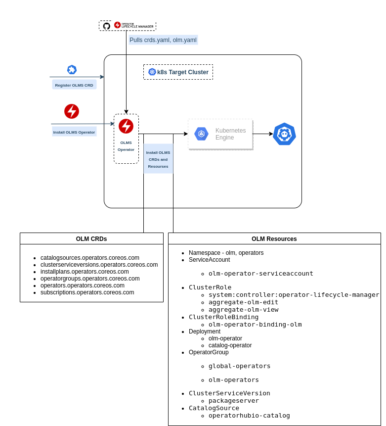

# olms
Operator Lifecycle Manager Supervisor




##### Install Operator Lifecycle Manager with Custom Operator Catalog for Kubernetes

- [OLM](https://github.com/operator-framework/operator-lifecycle-manager) extends Kubernetes to provide a declarative way to install, manage and upgrade Operators and their dependencies in a cluster.

- OLM has a concept of Catalogs from which Operators are available to install and being kept up to date.

- Installing OLM:
    - To install OLM in a k8s cluster, two `yaml` files need to be applied.
      1. `crds.yaml`
      2. `olm.yaml`
    - These yamls can be downloaded from the OLM's github [releases](https://github.com/operator-framework/operator-lifecycle-manager/releases) section:  
    - Applying these yamls:
      - Apply `crds.yaml` first
        ```bash
        $ kubectl apply -f https://github.com/operator-framework/operator-lifecycle-manager/releases/download/0.16.1/crds.yaml
        customresourcedefinition.apiextensions.k8s.io/catalogsources.operators.coreos.com created
        customresourcedefinition.apiextensions.k8s.io/clusterserviceversions.operators.coreos.com created
        customresourcedefinition.apiextensions.k8s.io/installplans.operators.coreos.com created
        customresourcedefinition.apiextensions.k8s.io/operatorgroups.operators.coreos.com created
        customresourcedefinition.apiextensions.k8s.io/operators.operators.coreos.com created
        customresourcedefinition.apiextensions.k8s.io/subscriptions.operators.coreos.com created
        ```
      - Apply `olm.yaml`:
        ```bash
        $ kubectl apply -f https://github.com/operator-framework/operator-lifecycle-manager/releases/download/0.16.1/olm.yaml
        namespace/olm created
        namespace/operators created
        serviceaccount/olm-operator-serviceaccount created
        clusterrole.rbac.authorization.k8s.io/system:controller:operator-lifecycle-manager created
        clusterrolebinding.rbac.authorization.k8s.io/olm-operator-binding-olm created
        deployment.apps/olm-operator created
        deployment.apps/catalog-operator created
        clusterrole.rbac.authorization.k8s.io/aggregate-olm-edit created
        clusterrole.rbac.authorization.k8s.io/aggregate-olm-view created
        operatorgroup.operators.coreos.com/global-operators created
        operatorgroup.operators.coreos.com/olm-operators created
        clusterserviceversion.operators.coreos.com/packageserver created
        catalogsource.operators.coreos.com/operatorhubio-catalog created
        ```
        
        ```bash
        $ kubectl get all -n olm
        NAME                                    READY   STATUS    RESTARTS   AGE
        pod/catalog-operator-66d58f7877-kg4wh   1/1     Running   0          155m
        pod/olm-operator-5f75dd4c6c-p88g5       1/1     Running   0          155m
        pod/operatorhubio-catalog-cs4zh         1/1     Running   0          153m
        pod/packageserver-6459f9b47c-76glx      1/1     Running   0          152m
        pod/packageserver-6459f9b47c-stmkd      1/1     Running   0          153m
        
        NAME                            TYPE        CLUSTER-IP       EXTERNAL-IP   PORT(S)     AGE
        service/operatorhubio-catalog   ClusterIP   10.108.137.92    <none>        50051/TCP   153m
        service/packageserver-service   ClusterIP   10.105.218.183   <none>        5443/TCP    153m
        
        NAME                               READY   UP-TO-DATE   AVAILABLE   AGE
        deployment.apps/catalog-operator   1/1     1            1           155m
        deployment.apps/olm-operator       1/1     1            1           155m
        deployment.apps/packageserver      2/2     2            2           153m
        
        NAME                                          DESIRED   CURRENT   READY   AGE
        replicaset.apps/catalog-operator-66d58f7877   1         1         1       155m
        replicaset.apps/olm-operator-5f75dd4c6c       1         1         1       155m
        replicaset.apps/packageserver-6459f9b47c      2         2         2       153m
        replicaset.apps/packageserver-69598696bd      0         0         0       153m

        ```
        
        ```bash
        $ kubectl get packagemanifests
        NAME                                       CATALOG               AGE
        starboard-operator                         Community Operators   160m
        redis-operator                             Community Operators   160m
        crossplane                                 Community Operators   160m
        keycloak-operator                          Community Operators   160m
        tidb-operator                              Community Operators   160m
        ditto-operator                             Community Operators   160m
        lightbend-console-operator                 Community Operators   160m
        akka-cluster-operator                      Community Operators   160m
        kubefed-operator                           Community Operators   160m
        snyk-operator                              Community Operators   160m
        wildfly                                    Community Operators   160m

        ```
    
---    
    
- By default the catalog source points to image - [quay.io/operatorhubio/catalog:latest](https://quay.io/repository/operatorhubio/catalog?tag=latest&tab=tags), which includes all the operators provided the [community-operators](https://github.com/operator-framework/community-operators/tree/master/upstream-community-operators)

- If you don't want, you're `catalog server` to support all these operators or want to include some other or you're own operator, you will need to build new image with operators you would like to be provided by `catalog server`.  
  ```bash
  $ git clone https://github.com/operator-framework/community-operators.git
  community-operators$ cd community-operators/
  community-operators$ rm ci.Dockerfile
  community-operators$ mv upstream.Dockerfile Dockerfile
  ```
  
  You can check all the supported operators within `upstream-community-operators` directory
  
  ```bash
  community-operators$ cd upstream-community-operators/
  community-operators/upstream-community-operators$ ls -1
  akka-cluster-operator
  anchore-engine
  apicast-community-operator
  apicurio-registry
  api-operator
  appdynamics-operator
  appranix
  appsody-operator
  aqua
  ...
  ```
  Operators which are of no interest can be removed and and other operators can be included in this directory which you would like catalog server should support.
  
  For example I want only `kafka` and `prometheus` operator
  ```bash
  community-operators/upstream-community-operators$ rm -rfv !(*kafka*|"prometheus")
  community-operators/upstream-community-operators$ ls -1
  banzaicloud-kafka-operator
  prometheus
  strimzi-kafka-operator
  ```
  
  Build the `catalog server` docker image - `docker build . --rm -t <any image registry username>/catalog-server`
  ```bash
  $ docker build . --rm -t on2411/catalog-server
  $ docker images | grep -i catalog
  on2411/catalog-server                                      latest                   06a973f1b90e        About a minute ago   43.6MB
  $ docker push on2411/catalog-server  
  ```
  
  ###### Note: if you're using `kind` then you will need to load the image in the kind cluster first:
  ```bash
  $ kind load docker-image on2411/catalog-server --name kind
  ```
  
  ```bash
  $ cat <<EOF | kubectl apply -n olm -f -
  > ---
  > apiVersion: operators.coreos.com/v1alpha1
  > kind: CatalogSource
  > metadata:
  >   name: custom-catalog
  >   namespace: olm
  > spec:
  >   sourceType: grpc
  >   image: docker.io/on2411/catalog-server:latest
  >   displayName: local Operators
  >   publisher: local.io
  > EOF
  catalogsource.operators.coreos.com/custom-catalog created

  $ kubectl get catalogsource -n olm
  NAME             DISPLAY           TYPE   PUBLISHER   AGE
  custom-catalog   local Operators   grpc   local.io    2s

  ```
  
  Delete the operatorhub catalog server
  ```bash
  $ kubectl delete catalogsource operatorhubio-catalog -n olm
  catalogsource.operators.coreos.com "operatorhubio-catalog" deleted
  ```
  
  ```bash
  $ kubectl get pods -n olm
  NAME                                READY   STATUS    RESTARTS   AGE
  catalog-operator-66d58f7877-kg4wh   1/1     Running   0          13h
  custom-catalog-dndrf                1/1     Running   0          9h
  olm-operator-5f75dd4c6c-p88g5       1/1     Running   0          13h
  packageserver-6459f9b47c-76glx      1/1     Running   0          13h
  packageserver-6459f9b47c-stmkd      1/1     Running   0          13h

  ```
  
  Now if you check list of packagemanifests, it will only have the ones we included.
  ```bash
  $ kubectl get packagemanifests 
  NAME                         CATALOG           AGE
  banzaicloud-kafka-operator   local Operators   9h
  prometheus                   local Operators   9h
  strimzi-kafka-operator       local Operators   9h

  ```